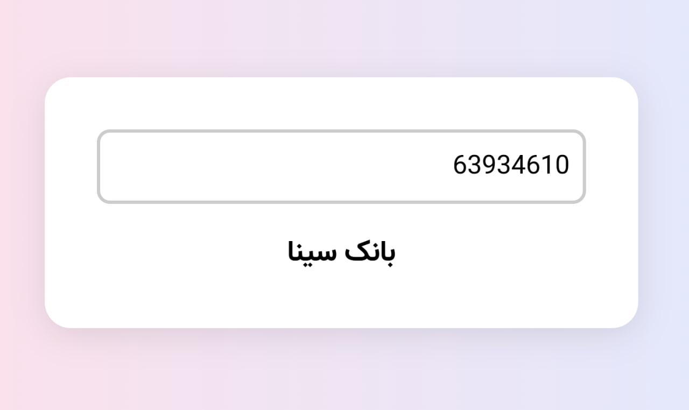

# Iran Bank Detector (JS)

A simple and lightweight JavaScript web app to detect Iranian banks based on the entered card number (BIN).

> تشخیص بانک ایرانی با استفاده از شماره کارت

## 🖼️ Preview



## 🔧 Features

- Built using [Mithril.js](https://mithril.js.org/) — fast and modern JavaScript framework
- Fully responsive UI
- Clean and minimal design
- Supports major Iranian bank BINs (first 6 digits of the card)
- RTL layout and Persian language support
- CDN support for [Vazir font](https://fontcdn.ir/)

## 🚀 Live Demo

👉 [Try it online](https://basemax.github.io/Iran-Bank-Detector-JS/)

## 📁 Project Structure

```
📦 Iran-Bank-Detector-JS
├── index.html        # Main HTML file
├── style.css         # CSS styles (includes Vazir font)
├── script.js         # App logic (Mithril.js + card detection)
├── preview.png       # Optional screenshot for README
└── README.md         # You're here!
```

## 🏦 Supported Banks

The app currently supports detection for the following BINs:

```
603799: بانک ملی
603770: بانک صادرات
603769: بانک کشاورزی
589210: بانک سپه
610433: بانک ملت
628023: بانک مسکن
627648: بانک توسعه صادرات
627961: بانک صنعت و معدن
627353: بانک تجارت
589463: بانک رفاه
639347: بانک پاسارگاد
627412: بانک اقتصاد نوین
622106: بانک پارسیان
627488: بانک کارآفرین
621986: بانک سامان
639346: بانک سینا
639607: بانک سرمایه
502806: بانک شهر
502938: بانک دی
627381: بانک انصار
639599: بانک قوامین
```

## 📦 Installation

Clone the repo and open `index.html` in your browser:

```bash
git clone https://github.com/BaseMax/Iran-Bank-Detector-JS.git
cd Iran-Bank-Detector-JS
open index.html
```

Or simply open the project in your favorite browser or IDE.

## 📜 License

This project is licensed under the MIT License.  

© 2025 [Max Base](https://github.com/BaseMax)
